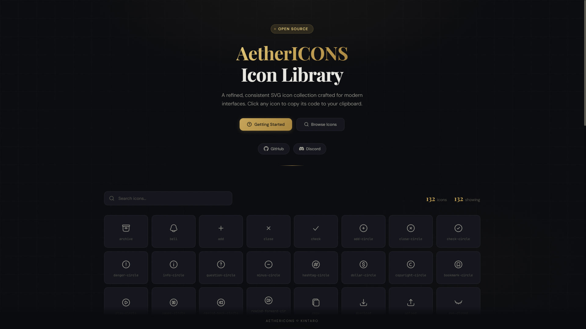
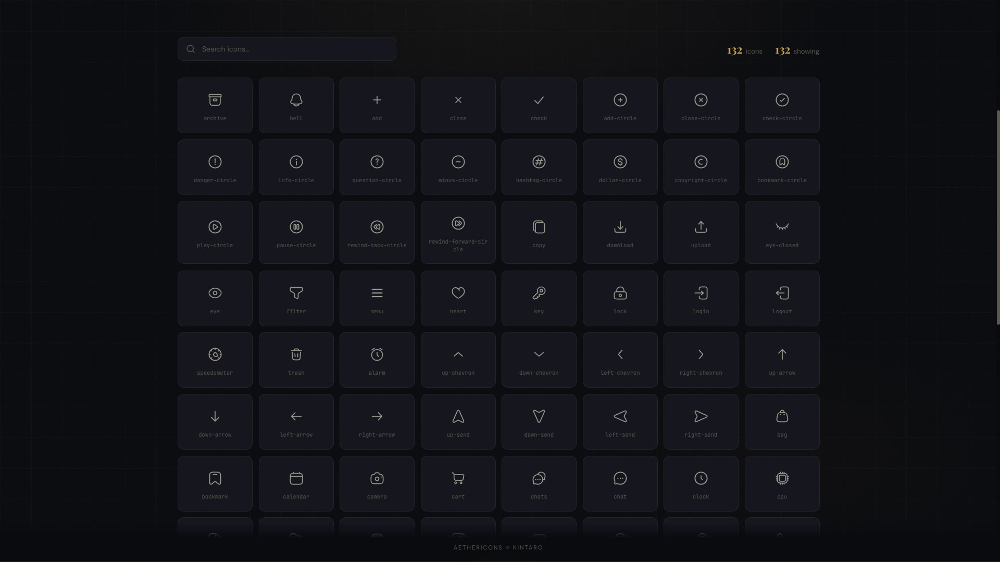
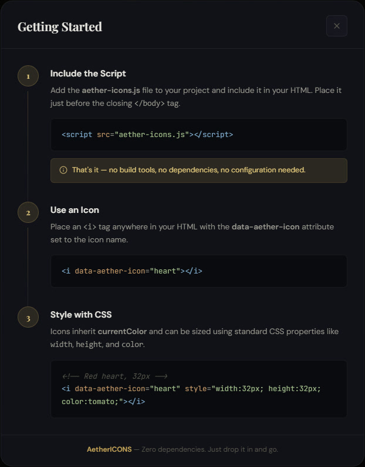
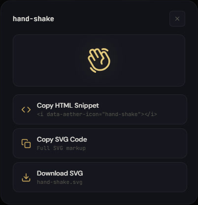

<a href="README.md">
  
</a>
<a href="README-TR.md">
  
</a>

  <br />
  <br />

<div align="center">
  
  <br />
  <br />

  <p>
    Temiz, tutarlı ve kullanımı kolay modern bir SVG ikon koleksiyonu.
  </p>


  <p>
    <a href="#usage">Kullanım</a> •
    <a href="#license">Lisans</a> •
    <a href="#gallery">Galeri</a>
  </p>

  <br />
  <br />
</div>

## 📷 Demo Link

- [https://xkintaro.github.io/aether-icons/](https://xkintaro.github.io/aether-icons/)
- [https://aether-icons.vercel.app/](https://aether-icons.vercel.app/)

## 📋 Hakkında

**Aether Icons**, tek bir JavaScript dosyası olarak sunulan, kendi kendine yeten bir SVG ikon kütüphanesidir. 100'den fazla özenle hazırlanmış ikon içerir ve kolay keşif ile kopyala-yapıştır yapabilmeniz için yerleşik, tarayıcı tabanlı bir önizleme sayfasıyla birlikte gelir.

## <a id="usage"></a>⚙️ Kullanım

Kurulum adımı veya bağımlılık yoktur. Sadece betiği dahil edin ve ikonları kullanın.

**1. Kütüphaneyi dahil edin**
```html
<script src="aether-icons.js"></script>
```

**2. Bir ikonu görüntüleyin**
```js
<i data-aether-icon="heart"></i>
```

## <a id="license"></a>📄 Lisans

Bu proje MIT Lisansı ile lisanslanmıştır. Detaylar için [LICENSE](LICENSE) dosyasına göz atabilirsiniz.

## 🖼️ Galeri <a id="gallery"></a>
 


#



#



#



#

<p align="center">
  <sub>❤️ Developed by "Mustafa TAŞAL" (kintaro)</sub>
</p>