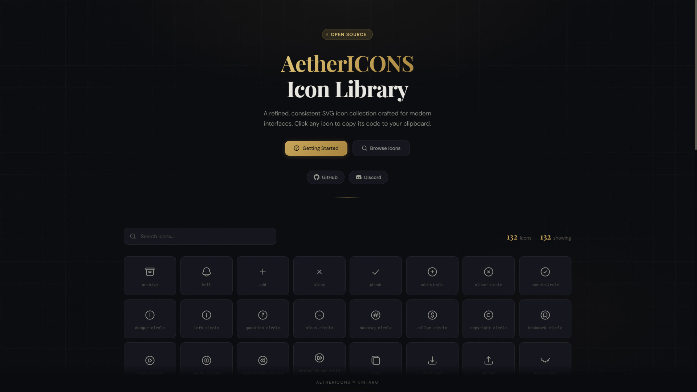
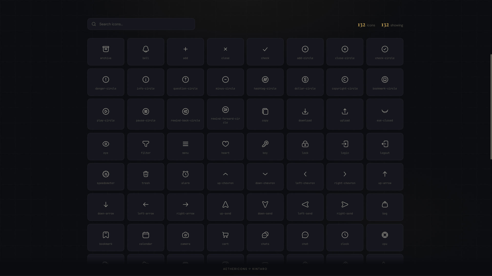
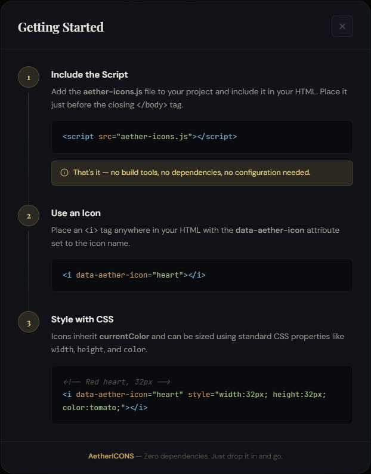
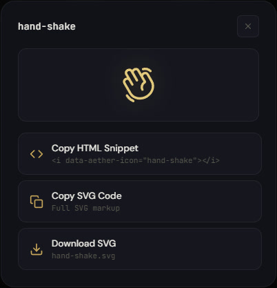

<div align="center">
  
  <br />
  <br />

  [](https://developer.mozilla.org/en-US/docs/Web/HTML)
  [](https://developer.mozilla.org/en-US/docs/Web/JavaScript)
  [](https://developer.mozilla.org/en-US/docs/Web/SVG)

  <p align="center">
    <b>A refined, modern SVG icon collection</b>
    <br />
    Clean, consistent, and easy to use.
    <br />
    <br />
    <a href="https://xkintaro.github.io/aether-icons/" target="_blank">Live Preview</a>
  </p>
</div>

---

## 📋 About

**Aether Icons** is a self-contained SVG icon library delivered as a single JavaScript file. It includes 100+ carefully crafted icons, and comes with a built-in browser-based preview page for easy exploration and copy-pasting.



## 🚀 Usage

There are no build steps or dependencies. Just include the script and use the icons.

**1. Include the library**
```html
<script src="aether-icons.js"></script>
```

**2. Render an icon**
```js
<i data-aether-icon="heart"></i>
```



<br/>
<br/>



<br/>
<br/>



---

<p align="center">
  <sub>❤️ Developed by Kintaro.</sub>
</p>
